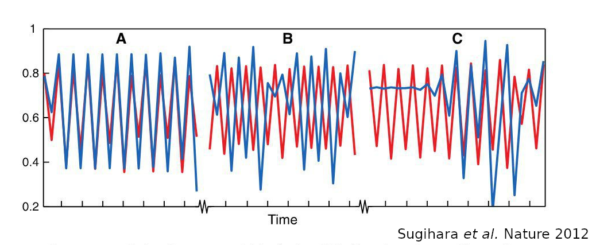

```{r setup, echo=FALSE, warning=FALSE, message=F}
library(knitr)
library(revealjs)
library(plotly)
#library(ggplot2)#; library(cowplot)
#library(gridExtra)
# library(dplyr); library(tidyr);
#library(quantreg)
opts_chunk$set(#fig.align = 'center', fig.show = 'hold',fig.height = 4,
               warning = FALSE, message = FALSE,
               error = FALSE, echo=FALSE)
options(formatR.arrow = TRUE, scipen=999)
```


```{r functions and facilities}
## Logistic map with time-varying K
Lmap <- function(a, X0 = 0.1, K=rep(1,steps), steps){
    ## A vector to store abundance data
    X <- c()
    ## Initial values
    X[1] <- X0
    ## Iterate the dynamics 150 time steps
    for(i in 2:steps){
        X[i] <- a*X[i-1] * (K[i-1] - X[i-1]) 
    }
    X
}
```

# Um alternativa às abordagens lineares

## Ruído X dinâmicas complexas

```{r motivation, fig.width = 9}
X1 <- Lmap(a = 3.9, X0 = 0.1, steps = 50)    
par(mfrow=c(1,2))
plot(X1, xlab = "Time", ylab = "X(t)",
     type="l", lwd=2, col="blue",
     main = "Deterministic", cex.main=2)
plot(rnorm(50,1,1), xlab = "Time", ylab = "X(t)",
     type = "l", lwd=2, col="red",
     main = "White noise", cex.main=2)
par(mfrow=c(1,1))
```

# Empirical Dynamic Modelling (**EDM**)

## George Sugihara et al.


## Empirical = data driven

* Dados dão retrato adequado do fenômeno
* Amostras grandes, *Big data*

## Dynamic

* Abordagem explícita de processos
* Amostra da dinâmica: **séries temporais**

## Modelling, but equation-free

> "science may be moving into a period where equations do not play the central role in describing dynamic systems that they have played in the last 300 years. This is largely the result of the rapidly increasing power of computers."

<small> De Angelis & Yurek, PNAS 2015 </small>


# Domínio de Aplicação: dinâmicas não-lineares

## Modelo linear de série temporal

$$ X_{t+1} = a_0 X_t + a_1 X_{t-1} + ... + a_n X_{t-n} $$

## Modelo não-linear de série temporal

$$ X_{t+1} = r X_t - r X_t^2 $$


## Dinâmicas não-lineares são complexas

```{r mapa logistico, fig.width = 9}
timesteps = 60
par(mfrow=c(2,2))
for(a in c(1.25, 2.9, 3.54, 3.9))
    plot(Lmap(a, X0=0.1, steps=timesteps), type="l",
         xlab = "Time", ylab = "X(t)",
         main = paste("r =",a), cex.main=2, col="darkblue", lwd=1.5)
par(mfrow=c(1,1))
```

## Correlação: inútil em dinâmicas não lineares



##

> Correlação não implica em causalidade e também **causalidade não implica em correlação**


# Previsão de dinâmicas não-lineares

## Exemplo: Mapa Logístico com sazonalidade ambiental

```{r mapa logistico sazonal}
## Number of interactions
timesteps <- 135
## Growth rate
a1 <- 3.58
## External driver: seasonal carrying capacity
Y <- sin(seq(0,10.5*pi, length=timesteps))/10 + 1
## A vector to store abundance data
X <- Lmap(a1, K = Y, steps = timesteps)
plot(X[-timesteps], xlab="Time", ylab="X", type="l", lwd=2, ylim=range(c(Y,X)))
lines(Y[-timesteps], type="l", lwd=2, col="blue")
```

## Previsão de curto prazo

```{r previsao curto prazo}
plot(X[-timesteps], xlab="Time", ylab="X", type="l", lwd=2, xlim = c(0,timesteps+10))
points(timesteps-1, X[timesteps-1], pch=19, col="blue", cex=1.5)
arrows(x0=timesteps-1, y0=X[timesteps-1], x1=timesteps+2, y1=X[timesteps-1]+0.1, col="blue", lwd=2, length=0.1)
arrows(x0=timesteps-1, y0=X[timesteps-1], x1=timesteps+2, y1=X[timesteps-1]-0.1, col="blue", lwd=2, length=0.1)
```


## Eventos similares na série temporal

```{r neighbors}
## Data frame with X at t0, t1 and t2
df1 <- data.frame(X.t0=X[1:(length(X)-2)],X.t1=X[2:(length(X)-1)],  X.t2=X[3:(length(X))])
## point to point Euclidian distance matrix
dist.m1 <- as.matrix(dist(df1[,1:3], upper=TRUE))
## Indexes of the 4 nearest neighbors of the last point in the time series
neigb1 <- order(dist.m1[(ncol(dist.m1)-1),])[2:5]
```


```{r time series with neighbors highlighted}
time1 <- min(neigb1,length(X)):(length(X)-1) # syntatic sugar
plot(time1, X[time1] , xlab="Time", ylab="X", type="b", lty=3)
cores <- c("blue", "red","green","orange", "magenta")
z <- 1
for(i in c(length(X)-3,neigb1)){
    ind <- i:(i+2)
    lines(ind, X[ind], type="b", col=cores[z], lwd=2, pch=19)
    z <- z+1}
```

## Um passinho adiante, por favor

```{r X time series with projected point}
time2 <- min(neigb1,length(X)):length(X) # syntatic sugar
plot(time2, X[time2] , xlab="Time", ylab="X", type="b", lty=3)
cores <- c("blue", "red","green","orange", "magenta")
z <- 1
for(i in c(length(X)-3,neigb1)){
    ind <- i:(i+2)
    lines(ind, X[ind], type="b", col=cores[z], lwd=2, pch=19)
    points(i+3, X[i+3], col=cores[z], pch=17, cex=1.5)
    z <- z+1}
arrows(x0=neigb1+3, y0=X[neigb1+3], x1=length(X)*.99, y1=X[neigb1+3],
       col=cores[-1])
```

## Uma outra maneira de ver os tripletos ...

```{r plot shadow df2}
## Plot of the manifold: add colored markers on last point and their neighbors
p2 <- plot_ly(data=df1[c(length(X)-3,neigb1),], x = ~X.t0, y=~X.t1, z=~X.t2,
              marker=(list(color=c("blue","red","green","orange", "magenta"))),
              type="scatter3d", mode="markers") %>%
    layout(scene = list(xaxis = list(title = 'X'),
                        yaxis = list(title = 'X (t+1)'),
                        zaxis = list(title = 'X (t+2)')))
p2
```

## ... que é um mapa do atrator

```{r plot shadow df3}
## Plot of the manifold: add colored markers on last point and their neighbors
p3 <- plot_ly(df1, x = ~X.t0, y=~X.t1, z=~X.t2, marker=(list(color=grey)), opacity=0.25) %>%
    layout(scene = list(xaxis = list(title = 'X'),
                        yaxis = list(title = 'X (t+1)'),
                        zaxis = list(title = 'X (t+2)'))) %>%
    add_markers(text = paste("time =",3:length(X)), showlegend = FALSE) %>%
    add_trace( x = ~X.t0, y=~X.t1, z=~X.t2, data=df1[c(length(X)-3,neigb1),],
              opacity=1,
              marker=list(color=c("blue","red","green","orange", "magenta")),
              type="scatter3d", mode="markers",
              text = paste("time =",rownames(df1[c(length(X)-3,neigb1),])), showlegend = FALSE)
p3
```

# Causalidade

## Cross-mapping

```{r X and Y time series with neighbors highlighted}
plot(time2, X[time2] , xlab="Time", ylab="X", type="b", lty=3,
     ylim=range(X,Y))
lines(time2, Y[time2])
cores <- c("blue", "red","green","orange", "magenta")
z <- 1
for(i in c(length(X)-3,neigb1)){
    ind <- i:(i+2)
    lines(ind, X[ind], type="b", col=cores[z], lwd=2, pch=19)
    points(ind,Y[ind], col=cores[z], pch=19)
    z <- z+1}
```

# Obrigado
